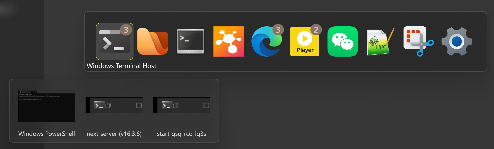
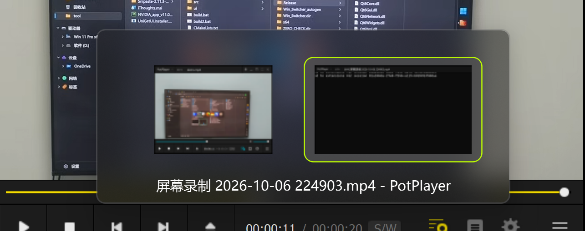

# AltTaber

Windows 窗口切换工具，支持 Alt+Tab 切换应用、Alt+` 切换同应用窗口，均带缩略图预览。

## 演示

[查看演示视频](https://github.com/qlsusu/AltTaber_me/raw/main/demo.mp4)

| Alt+Tab 切换应用 | Alt+` 切换窗口 |
|:---:|:---:|
|  |  |

## 功能

- **Alt + Tab**：在应用之间切换
- **Alt + `**：在同一应用的不同窗口之间切换
- **鼠标选择**：呼出切换器后，将鼠标停留在目标 app/窗口上，松开 Alt 即可切换

## 如何使用

1. 下载 [AltTaber_v1.0.zip](AltTaber_v1.0.zip) 并解压
2. 运行 `AltTaber.exe`
3. 使用 Alt + Tab 或 Alt + ` 切换窗口

## 构建

需要 Qt 5.15+ 和 CMake：

```bash
cmake -B build -G "Visual Studio 17 2022"
cmake --build build --config Release
```

## 引用

本项目借鉴了 [AltTaber](https://github.com/MrBeanCpp/AltTaber) 项目。

## 许可证

MIT
